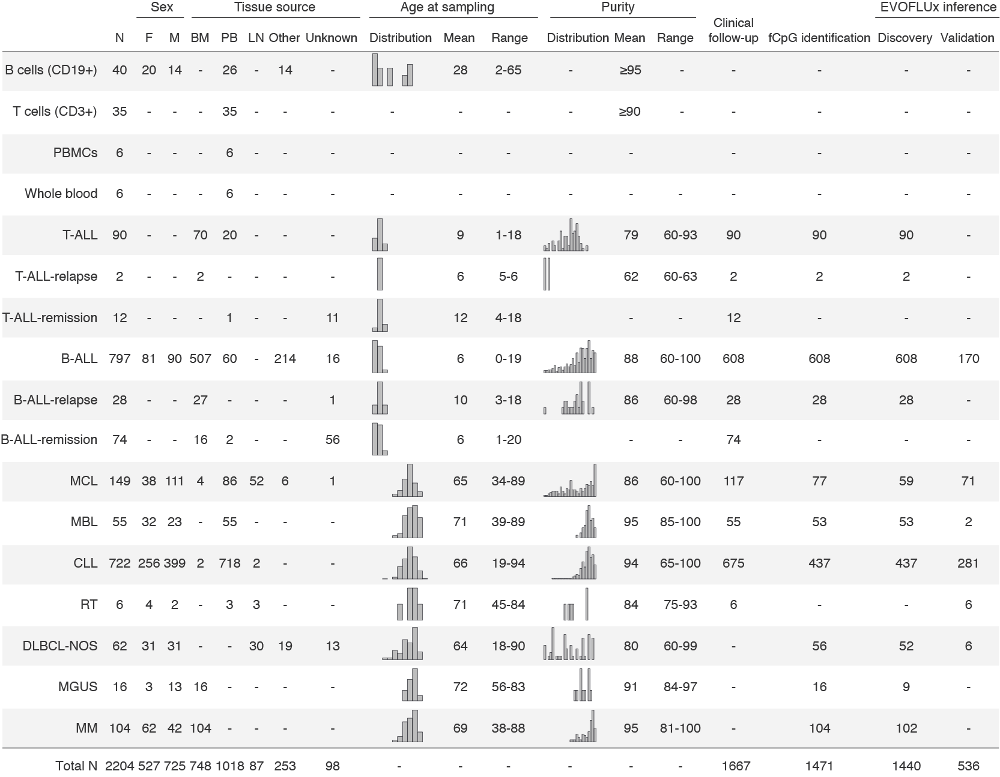

# EVOFLUx

Code accompanying the findings in [Gabbutt and Duran-Ferrer, 2025](https://www.medrxiv.org/content/10.1101/2023.11.10.23298336v2)

## Citation
If you use any data or code derived from this study, please cite: 
Gabbutt and Duran-Ferrer, et al 2025. Our pre-print version can be found [here](https://www.medrxiv.org/content/10.1101/2023.11.10.23298336v2)

## LICENSE
LICENSE terms can be found [here](https://github.com/CalumGabbutt/evoflux/blob/main/LICENSE)

## Overwiew of the samples used in the study

Brief table summarizing the samples used in the study

## Code
Here, we provide some html notebooks for reproducing some figures of the manuscript including: 
[Clinical analyses](https://duran-ferrerm.github.io/evoflux/Data_source_Fig.5.html) 
[Gene expression](https://duran-ferrerm.github.io/evoflux/Data_source_Fig.1G.html)  
[Methylation changes in longitudinal CLL samples](https://duran-ferrerm.github.io/evoflux/Data_source_Fig.4AB.html). 

Please, note that further notebooks will be uploaded soon! :-)

## Data availability
No new methylation bead array data was generated in the course of this study. The harmonised and filtered methylation matrix was deposited using [Zenodo](https://doi.org/10.5281/zenodo.15479736).
Previously published DNA methylation data re-analysed in this study can be found under accession codes: 
B cells, EGAS00001001196; ALL, GSE56602, GSE49032, GSE76585, GSE69229; MCL, EGAS00001001637, EGAS00001004165; CLL, EGAD00010000871, EGAD00010000948, EGAD00010001975; MM, EGAS00001000841; DLBCL, EGAD00010001974. External DNA methylation data for sorted immune cells, GSE137594 and GSE184269. For whole-blood samples, GSE72773, GSE55763, GSE40279 and GSE36054.
CLL gene expression data is available EGAS00001000374 and EGAS00001001306. 
ChIP-seq datasets are available from Blueprint https://www.blueprint-epigenome.eu/ under the accession EGAS00001000326. 
Matched WES and WGS are available under accessions EGAS00000000092 and EGAD00001008954 respectively. 

## Contact
If you have any question, comment or suggestions please contact me at: *maduran@recerca.clinic.cat* :-)
